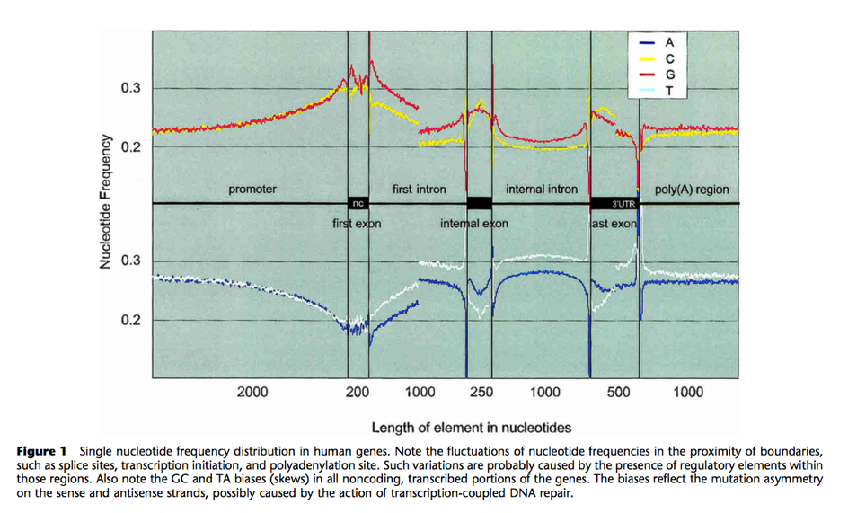

# ​​Lab 1: Unix and Python programming
In the Python assignments you are expected to use Python and no additional libraries. The goal is to practice writing "pure" Python for those occasions when libraries or other good tools are not available for one reason or another. Assignment 1 can be completed after the first lecture and 2-3 after the Video Lecture 1, 4-6 after Video Lecture 2, 7-9 after Video Lecture 3.

To help you get organized the assignments (except those related to a Video Lecture)​ should be solved by adding code to the following code skeleton: [lab1.py](lab1.py)

It is important that you do the assignments in the order presented here. You will not gain time by skipping the initial assignments. 

## Assignments

1. [Unix introduction](#1-unix-introduction)
2. [Data type: strings​](#2-data-type-strings) (Video Lecture 1, string_exercise.py)
3. [Random DNA sequences](#3-random-dna-sequences)
4. [Real DNA sequences​](#4-real-dna-sequences​)
5. [Data type: lists](#5-data-type-lists) (Video Lecture 2, list_exercise.py)
6. [DNA, RNA or Protein](#6-dna-rna-or-protein)
7. [Re-formatting sequences](7-​re-formatting-sequences)
8. [Data type: dictionaries​](#8-data-type-dictionaries​) (Video Lecture 3, organismcount.py)
9. [Translate DNA](#9-translate-dna)


## 1. Unix introduction

Solve these assignments in a terminal window, and perhaps using a browser.
1. Create a directory structure for this lab in your home directory using `mkdir` and `cd`. There should be a directory for the course, and within it a directory for each lab. Also download and unzip the exercises for the video lecture here: [exercises.zip](exercises.zip)​ and place them in the course directory. 
2. Use the `man` command to figure out...
	1. what the command `ls -l` does.
	2. how you delete a directory and its contents with `rm`.
3. Find out, perhaps using​​ `man`, what the following commands are for. If you want you can use the file [gpcr.tab](gpcr.tab), which is in the [exercise.zip](exercise.zip) archive, as an example.
   * cat
   * more or less
   * head
   * tail
   * wc
   * grep
   * sort​
   * uniq
   * cut​
​​
4. Working in Unix

Here you will need to use Unix redirection of input and output. You can have a look at the [Unix introduction](unix_introduction.pdf)​ slides if you want.

The file [gpcr.tab](gpcr.tab)​​ contains data concerning G-coupled protein receptors from a number of species. We will use it solve the following in the terminal:
1. Take a look at the gpcr.tab using head. How many columns are there (if you count by eye)? 
2. How many lines is there in the file?
3. Use grep and wc to find out how many human GPCRs there are listed. Do you search for "human" or "Homo sapiens"?
4. How long is the shortest sequence listed in the same file? Use cut and sort!
5. How many species are named in gpcr.tab?

## 2. Data type: strings​ 
Do this assignment after Video Lecture 1. The assignment is to complete the code in the `string_exercise.py` file from the `exercise.zip` archive. 

## 3. Random DNA sequences
To help you get organized this assignments​ should be solved by adding code to the following code skeleton: `lab1.py​`

Add the functionality to your software to generate random DNA sequence in Fasta format, and to calculate the nucleotide composition (i.e. the frequence of each nucleotide) of the random DNA sequence.

You should add your code to the functions: `random_DNA(N)` and 
`print_nucleotide_composition` , 
and adapt the `main()` function so it will run your code.

### Requirements
Your program should get the length of the sequence from the command line and use the name "myrandomsequence" 
The session should look something like:​

```
bash$ python lab1.py --lab 3 40
I will try to run lab number: 1.3
Random DNA
>myrandomsequence
CCTCGCTCTGACTTAGCTTTGATACTAATATACATACAAT
Composition: A: 0.3 C:0.25 T:0.35 G:0.1
```

The output must be in valid Fasta format, and contain the nucleotide composition. It should also be able to handle the case where the user specifies zero length.​​

​The Python module `random` is suitable to use in this assignment. Take a look at the [online documentation the random module](https://docs.python.org/3/library/random.html). Which function do you find most useful for this assignment?​


## 4. Real DNA sequences​
Add the functionality your software (`lab1.py`) to generate dna sequences with a nucleotide frequency similar to the one for the first exon in the figure below. You are only allowed to use the `random.random()` function that generates a random real number in the [0,1] interval. Add your code in the function `real_DNA(N)`.





### Requirements

Your program should get the length of the sequence from the command line and use the name "realdnasequence" 
The session should look something like:​

```
bash$ python lab1.py --lab 4 500
I will try to run lab number: 1.4
Real DNA
>realdnasequence
GACCCCTGGTCGGGCGAAGAGGTCTGAGCAAGTAACAAGGGGCATTTAGTGCAGAGAGGCCATCCCGTTGTACGCGCACCGAATGGGTCCCTCCCTGCAGGCTACCGCTCGGCGCCTGAAAGTGTGGCCAGAACTCATTGAGTGTGACGACACGGTCCGCTCTGGCCCAGGACAAGTCGTCTATCTGGGAGCTCGCATAGTTTCAGCGAGGTGTCAACCCAGCGTTATACCCGAGCCTGGTACCGACCGAAATAATTAAGGCACGCACGAGCTACATCGAAAGGACGCAAGGTTCCCCGTTAGGGTTACACCACGACGCCGATTGCCGAAGCGTCGGGCTGTTCACCGGGAGGTGATATCTCCGGGCGCGGGGTGGGTCCGAGGTAGGTCGGCCTCATGGCCGGTCGAGCCGGAAGCTAACGGACTCAAACCACTTTCTCAGTGTGGGCAGCTTGAAAGGCTACGTCCCACAGCGTACACGGAGGCGAGCAAGGACGTTA
Composition: A:0.222 C:0.28 T:0.18 G:0.318
```

The output must be in valid Fasta format, and contain the correct nucleotide composition. It should also be able to handle the case where the user specifies zero length.​​

How long does the sequence have to be in order for the composition to be relatively stable?


## 5. Data type: lists
Do this assignment after Video Lecture 2. The assignment is to complete the code in the `list_exercise.py` file from the `exercise.zip` archive. 


## 6. DNA, RNA or Protein?
Add the functionality to your software to decide whether a Fasta file contains DNA, RNA or protein sequences. The script must read all sequences in the file and output one of the words `DNA`, `RNA`, `protein`, or `mixed` depending on the contents. The word `mixed` is used if the file seems to contain more than one type of sequence. 

How can you determine whether a sequence is DNA or protein?

To help you get organized and help you write reusable code. Your code should be based on four subfunction.

* `read_fasta(filename)`, a function that reads a fasta file​. If you don't know about the fasta sequence format you read about it here​.
* `isDNA(seq)`, a function that returns true if a sequence is DNA, and false otherwise.
* `isRNA(seq)`, a function that returns true if a sequence is RNA, and false otherwise.
* `isProtein(seq)`, a function that returns true if a sequence is protein, and false otherwise.
You will also have to write the code in the main to call the functions to get the desired functionality, i.e read the file, loop over all sequences etc.

TIP: it will be much easier if isDNA, isRNA, isProtein are designed to work on _one_ sequence (like stated above). Then you can use these functions to count how many sequences are of given type. 


Test data
[longseqs.fa](longseqs.fa) is only DNA. Notice that this file contains the "ambigouity character" N!
[proteins.fa](proteins.fa) there is​ only proteins
[rna.fa](rna.fa) there is​ only RNA
[mixed.fa](mixed.fa) contains DNA, RNA and protein

### Requirements
A typical session looks like:

```
bash$ python lab1.py --lab 6 longseqs.fa
1.6 DNA, RNA or Protein 
DNA
bash$ python lab1.py --lab 6 proteins.fa
1.6 DNA, RNA or Protein 
protein
bash$ python lab1.py --lab 6 rna.fa 
1.6 DNA, RNA or Protein
RNA
bash​$ python lab1.py --lab 6 mixed.fa    
​1.6 DNA, RNA or Protein​
mixed
```


## 7. Re-formatting sequences​
Add the functionality to reformat sequences from [Stockholm format](https://en.wikipedia.org/wiki/Stockholm_format) to fasta format
with the sequences broken down to rows at most 60 characters wide.


For exampel, if the input is ​
```
# STOCKHOLM 1.0
bovine   MDSKGSSQKGSRLLLLLVVSNLLLCQGVVSTPVCPNGPGNCQVSLRDLFDRAVMVSHYIHDLSSEMFNEFDKRYAQGKGFITMALNSCHTSSLPTPEDKEQAQQTHH
mouse    MDAKGSQQKGSR-------SNLLLCQGVVSTPVCPNGPGNCQVSLRDLFDRAVMVSHYIHDLSSEMFNEFDKRYAQGKGFITMALNSCHTSSLPTPEDKEQAQQTHH
//
```

then the output should be
```
>bovine
MDSKGSSQKGSRLLLLLVVSNLLLCQGVVSTPVCPNGPGNCQVSLRDLFDRAVMVSHYIH
DLSSEMFNEFDKRYAQGKGFITMALNSCHTSSLPTPEDKEQAQQTHH
>mouse
MDAKGSQQKGSR-------SNLLLCQGVVSTPVCPNGPGNCQVSLRDLFDRAVMVSHYIH
DLSSEMFNEFDKRYAQGKGFITMALNSCHTSSLPTPEDKEQAQQTHH
```


### Suggested approach
There are many ways of solving this problem, but a good solutions involves identifying smaller smaller problems and writing functions that solves them. Here is one suggestion.
​* Write a function for handling reading of sequences, and nothing else (`read_stockholm(seqfile)`)
* Write a function that takes a string (representing a sequence) and formats it so that each line is at most 60 characters wide (`string60(str)`) by adding a newline every after every 60 chars.
* Have a short main part of your code that reads the command line calls the sequence-reading functions. 
​
### Data
We have three test cases. Your program handle all of the cases (right-click on the link to download the file, if the file just opens in the browser).
* A simple ​​​[test case with three sequences](longseqs.sto).
* [Shorter sequences](shortseq.sto) How should your program handle this file?
​​* A ["corner case"](cornercase.sto) this file is empty, except for the prefix and suffix necessary in Stockholm files.
* As a fourth test case, go to http://pfam.xfam.org and download the protein alignment for domain family PF00041 in Stockholm format. Verify that your program works well with this data!

### Requirements​​
Your script must be able to read from any Stockholm file you want, with markup (#=GF etc) removed.
Every sequence in a file must be read and reformatted.
Your script must allow for, but no require, empty lines inbetween sequences. 
A typical session looks like this:​
```
$ python lab1.py --lab 7 longseqs.sthlm
>gene4711
ACGTACGTACGTACGTACGTACGTACGTACGTACGTACGTACGTACGTACGTACGTACGT
ACGTACGTACGTACGTACGTACGTACGTACGTACGTACGTACGTACGTACGTACGTACGT
>hubba
ACGTACGTACGTACGTACGTACGTANNNNNNNNNNTACGTACGTACGTACGTACGTACGT
ACGTACGTACGTACGTACGTACGTACGTACGTACGTACGTACGTACGTACGTACGTACGT
T
>gene4712
AAAAAAAAAAAAAAAAAAAAAAAAAAAAAAAAAAAAAAAAAAAAAAAAAAAAAAAAAAAA
CCCCCCCCCCCCCCCCCCCCCCCCCCCCCCCCCCCCCCCCCCCCCCCCCCCCCCCCCCCC
GGGGGGGGGGGGGGGGGGGGGGGGGGGGGGGGGGGGGGGGGGGGGGGGGGGGGGGGGGGG
TTTTTTTTTTTTTTTTTTTTTTTTTTTTTTTTTTTTTTTTTTTTTTTTTTTTTTTTTTTT
```


## 8. Data type: dictionaries​
Do this assignment after Video Lecture 3. The assignment is to complete the code in the `organismcount.py` file from the `exercise.zip` archive. 


## 9. Translate DNA

Add the functionality to your software to translate DNA using the [genetic code](http://en.wikipedia.org/wiki/Codon) (the standard code) and finding the longest open reading frame (ORF), i.e., **the longest sequence of codons without a stop codon**. 

* Input is one or more sequ​ences in Fasta format.
* Output is the translated sequence,
* The longest ORF in each sequence should be identified.
* The result should be presented like the example output below.
* Your program must gracefully handle ambigous characters. Translate to X if it is not a regular codon. 
* Your program must be well structured and be written with functions performing important algorithmic steps.
Add your code to the functions `translate_seq` and `find_longest_orf` and use the main to sew it all together.

Example session:


```
bash$ python lab1.py --lab 9 translationtest.dna 
I will try to run lab number: 1.9
Translate DNA
>single_stop_codon
*
Longest ORF:  is 0 amino acids
>stopcodons
***************************
Longest ORF:  is 0 amino acids
>ambiguities
XXXXXXXXXXXXXXXXXX
Longest ORF: XXXXXXXXXXXXXXXXXX is 18 amino acids
>proteinalphabet ARNDCQEGHILKMFPSTWYV
ARNDCQEGH*ILKMFPSTWYV
Longest ORF: ILKMFPSTWYV is 11 amino acids
>proteinalphabet2
ARNDCQEGHILKMFPSTWYV
Longest ORF: ARNDCQEGHILKMFPSTWYV is 20 amino acids
>proteinalphabet3 with stop
ARND*C*Q*EG*HILKM*FPSTWY*V
Longest ORF: FPSTWY is 6 amino acids
>tooshort  No open reading frame here!

Longest ORF:  is 0 amino acids
>short   The longest reading frame is one codon (for "Q")
*Q*
Longest ORF: Q is 1 amino acids
>Hidden message can you find it?????
```


Use this file: [translationtest.dna](translationtest.dna) to test your script. 

